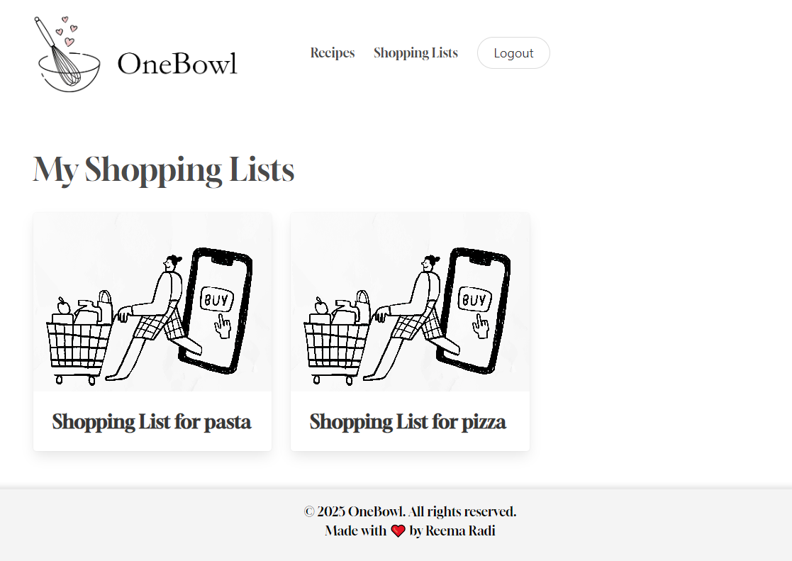

# OneBowl - Frontend
## Project Description
OneBowl is a full-stack web application built with React and Django that helps home cooks organize and manage their favorite recipes. Users can create, store, and edit recipes with detailed ingredient lists and step by step cooking instructions. The app also includes a shopping list feature, allowing users to create, view, update, and delete shopping lists based on their selected recipes. OneBowl serves as all in one digital recipe organizer.

## Repository Description
This repository contains the frontend code built in React.  It handles the user interface, routing, and integration with the Django REST API.

## Technologies 

* React.js
* JavaScript
* Axios 
* React router
* Bulma
* Google fonts
* Custom CSS
* Visual Studio Code


## Backend Repository
[OneBowl - Backend Repo ](https://github.com/Reema1r/OneBowl-Backend)
## Installation

### 1- Clone frontend repository
```bash
git clone https://git.generalassemb.ly/reema1radi/oneBowl-project-frontend.git
```
### 2- Navigate to frontend folder
```bash
cd oneBowl-project-frontend
```

### 3- Install dependencies
```bash
npm install
```
### 4- Start the server
```bash
npm run dev
```
## Screenshots 

This is the app homepage, where the user can choose to either log in or sign up 


After logging in, the user will be directed to this page


The user can click on any recipe to view its details, edit or delete the recipe, and create a shopping list


All the shopping lists created by the user are displayed here. 


The user can click on any shopping list to view its details, edit or delete it

## IceBox Features
* Recipe and Shopping List export as PDF files
* Public Recipe Sharing
* Ratings System (allow users to rate recipes)
* Recipe Search and Filtering (by ingredients, cuisine...etc.)
